# HealthPulse AI

### Healthcare Appointment & Follow-up Manager

HealthPulse AI is an appointment scheduling and clinical follow-up management platform built with React, Node.js, Express, MongoDB, and Google Gemini AI. It automates patient symptom triage, prevents double-booking through database-enforced concurrency control, and translates doctor clinical notes into structured, patient-friendly care plans.

[](https://nodejs.org/)
[](https://react.dev/)
[](https://expressjs.com/)
[](https://www.mongodb.com/)
[](https://ai.google.dev/)
[]()

---

## 1. The Problem

Standard appointment booking applications fail to support real clinical workflows because they treat healthcare scheduling as simple calendar slot reservations:

* **Patients** arrive with unstructured, subjective symptoms and lack medical context before consultations, leading to delayed triage and unguided consultations.
* **Doctors** face time constraints during visits, lacking structured intake summaries, and write dense medical jargon that patients struggle to understand after leaving the clinic.
* **Clinic Administrators** struggle to maintain doctor availability when managing fluctuating working hours, slot durations, and unexpected staff leave days that invalidate already-booked appointments.

HealthPulse AI addresses the complete clinical lifecycle: pre-visit intake triage $\rightarrow$ atomic slot reservation $\rightarrow$ doctor consultation $\rightarrow$ patient-friendly care plan generation $\rightarrow$ reliable follow-up reminders.

---

## 2. End-to-End Workflow

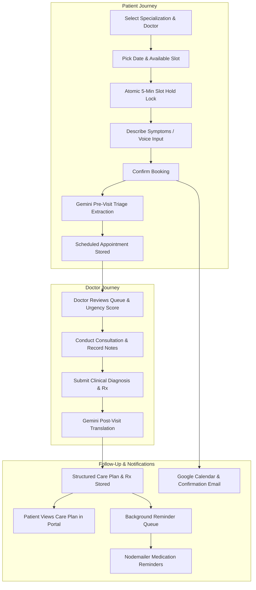

---

## 3. Visual Tour & Application Screenshots

### 🔐 Authentication & Role-Based Access Control
HealthPulse AI features a clean, unified authentication gateway supporting Patients, Doctors, and Clinic Administrators with instant prefilled evaluator access.

| Sign In with Instant Evaluator Demo Accounts | Account Registration & Role Selection |
| :---: | :---: |
| 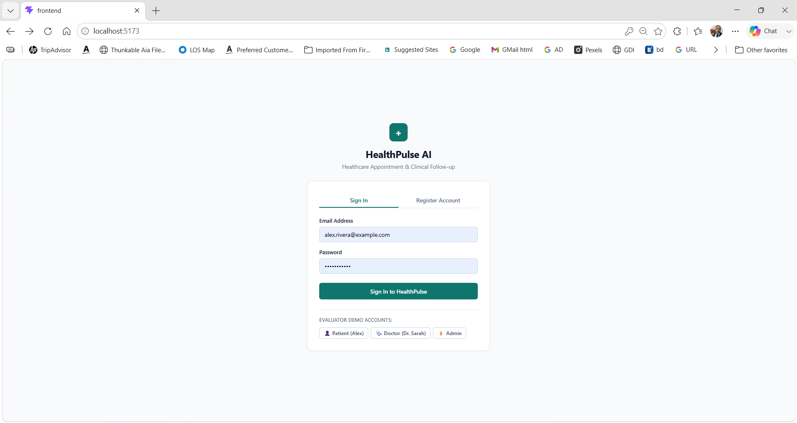 | 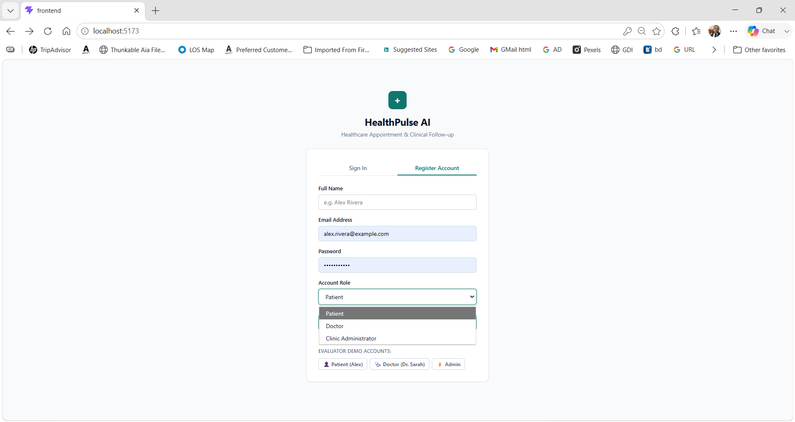 |

---

### 🏥 Clinic Administration & Doctor Management (Admin Portal)
Administrators configure specialist rosters, modify working hours, set slot durations, and manage leave calendars with real-time KPI metrics.

| Clinic Operations & Specialist Availability Dashboard | Add Specialist Doctor Profile Modal |
| :---: | :---: |
| 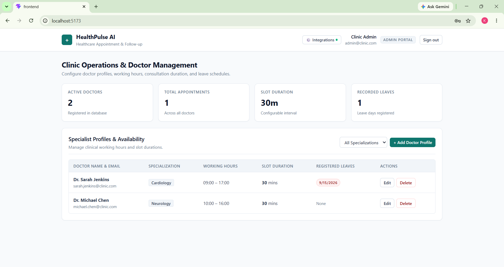 | 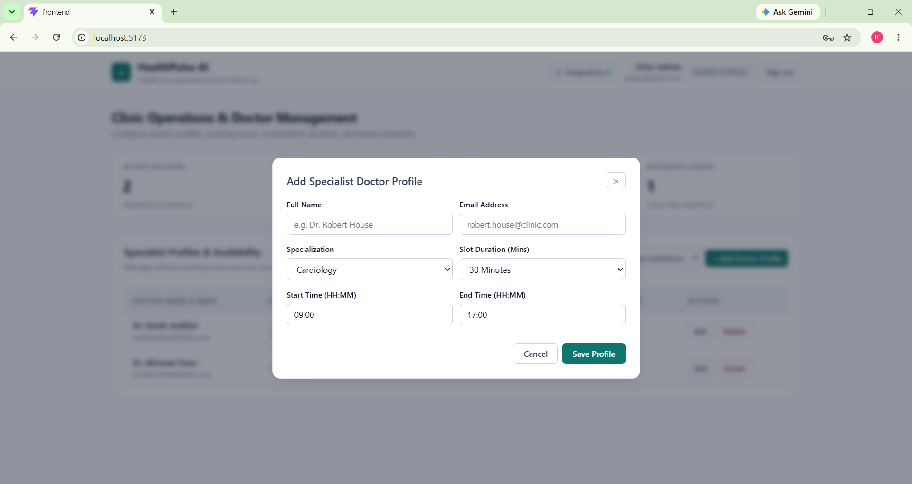 |

---

### 🩺 Dynamic Booking, Atomic Slot Hold & AI Triage (Patient Portal)
Patients select specialist slots with an **atomic 5-minute database reservation hold countdown**, use **🎙️ Voice Input** to state symptoms, and receive instantaneous **Google Gemini 1.5 Flash AI Triage** assessing urgency and generating clinical questions.

| Dynamic Slots & 5-Min Atomic Reservation Hold | Real-Time Gemini AI Triage Extraction & Booking Confirmation |
| :---: | :---: |
| 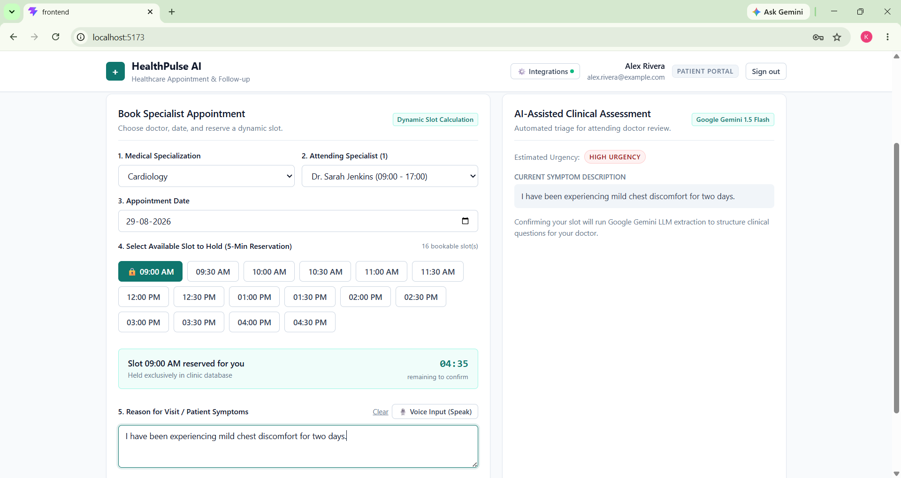 | 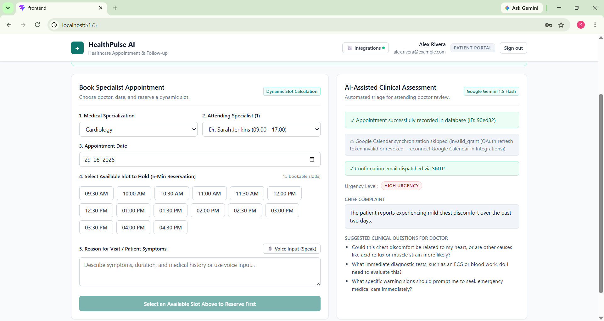 |

---

### 📋 Patient Appointment History & Care Plans
A centralized patient dashboard tracking upcoming consultations, AI triage urgency badges, rescheduling/cancellation controls, and structured post-visit care plans.

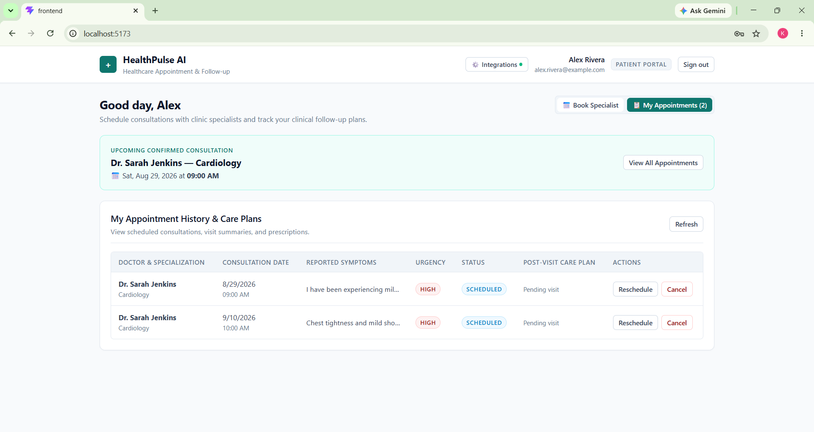

---

### 👨‍⚕️ Doctor Clinical Workspace, AI Intake & Consultation
Doctors review assigned patient queues annotated with AI pre-visit summaries and suggested questions, conduct consultations with automated care plan generation, and register staff leave dates.

| Assigned Patient Queue with AI Urgency & Questions | Clinical Consultation & Gemini Care Plan Translation |
| :---: | :---: |
| 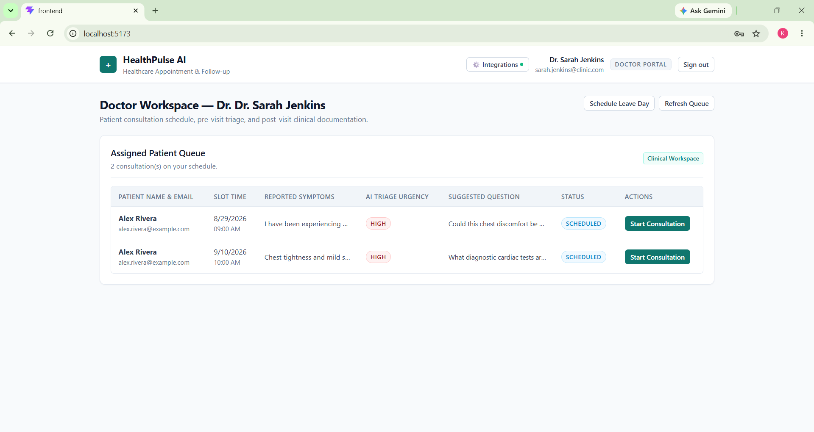 | 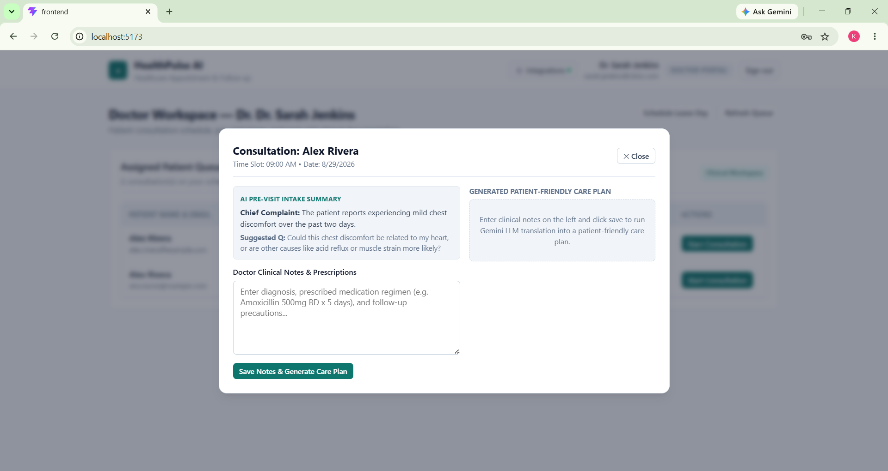 |

| Schedule Doctor Leave Day & Cascade Cancellation |
| :---: |
| 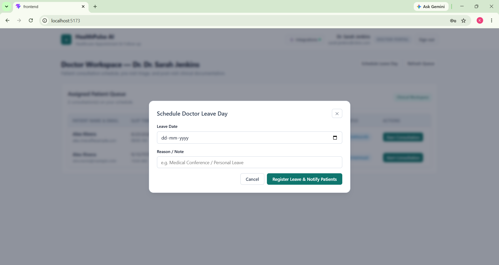 |

---

### 📅 Live Integrations: Google Calendar & Email Dispatch
Automated calendar event synchronization and reliable SMTP / Gmail appointment confirmation dispatches.

| Google Calendar Live Event Insertion | Nodemailer / Gmail Appointment Confirmation Email |
| :---: | :---: |
| 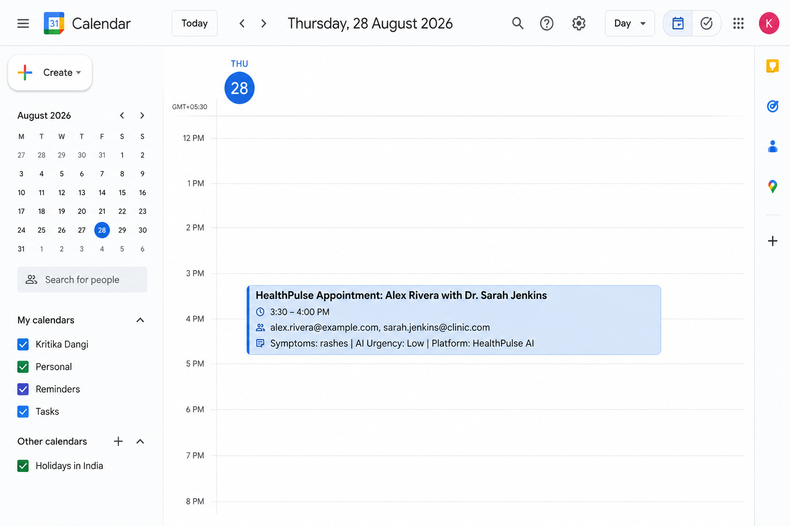 | 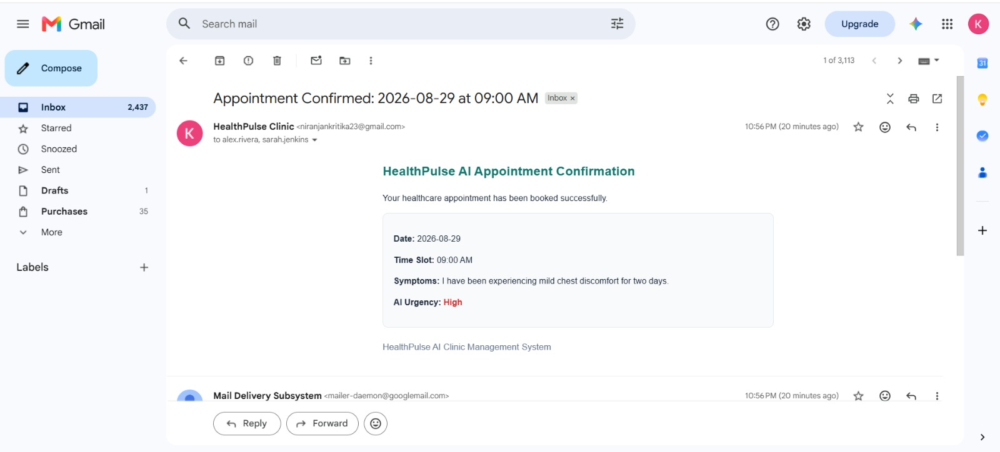 |

---

## 4. Key Features & Implementation Status

| Feature | Description | Implementation Status | Technical Location |
| :--- | :--- | :---: | :--- |
| **Role-Based Auth (RBAC)** | JWT authentication with password hashing (bcrypt) and protected routes for Patients, Doctors, and Admins. | **Implemented** | [`backend/controllers/authController.js`](./backend/controllers/authController.js) |
| **Dynamic Slot Engine** | Slices working hours by slot duration, mathematically excluding booked appointments and doctor leave dates. | **Implemented** | [`backend/controllers/doctorController.js`](./backend/controllers/doctorController.js#L95) |
| **Double-Booking Prevention** | Database compound unique index + MongoDB Session transactions to physically prevent concurrent duplicate bookings. | **Implemented** | [`backend/models/Appointment.js`](./backend/models/Appointment.js#L54) |
| **Atomic 5-Min Slot Hold** | 5-minute temporary exclusive hold on slots with MongoDB TTL auto-expiry and live frontend countdown. | **Implemented** | [`backend/controllers/appointmentController.js`](./backend/controllers/appointmentController.js#L15) |
| **Doctor Leave Handling** | Records leave, transitions affected appointments to `Cancelled`, deletes calendar events, and emails patients. | **Implemented** | [`backend/controllers/doctorController.js`](./backend/controllers/doctorController.js#L52) |
| **AI Pre-Visit Triage** | Extracts Urgency (`Low`/`Med`/`High`), Chief Complaint, and 3 suggested doctor questions via Gemini LLM. | **Implemented** | [`backend/services/aiService.js`](./backend/services/aiService.js#L11) |
| **AI Post-Visit Summary** | Translates doctor notes into patient-friendly explanation, structured Rx schedule, and follow-up timeline. | **Implemented** | [`backend/services/aiService.js`](./backend/services/aiService.js#L56) |
| **Medication Reminder Queue** | Persistent MongoDB job queue with bounded exponential backoff (`2^attempts`), duplicate prevention, and retry limits. | **Implemented** | [`backend/services/cronService.js`](./backend/services/cronService.js#L12) |
| **Email Notifications** | Dispatches booking, cancellation, leave, reschedule, and reminder emails with status reporting (`EMAIL_SENT`, `EMAIL_FAILED`, `EMAIL_NOT_CONFIGURED`). | **Implemented** | [`backend/services/emailService.js`](./backend/services/emailService.js) |
| **Google Calendar Sync** | OAuth 2.0 integration for inserting, patching (rescheduling), and deleting calendar events. | **Configured** *(Requires user OAuth credentials in `.env`)* | [`backend/services/calendarService.js`](./backend/services/calendarService.js) |
| **Voice-to-Text Input** | Speech recognition API for hands-free symptom recording in the patient portal. | **Implemented** | [`frontend/src/App.jsx`](./frontend/src/App.jsx#L280) |

---

## 5. Engineering Highlights

### 🔒 A. Double-Booking Prevention Mechanism
Relying on frontend checks or a read-before-write query is insufficient under concurrent load because two requests can read a slot as "available" simultaneously.

HealthPulse AI solves this at the database engine layer:
1. **Compound Unique Index:** `appointmentSchema.index({ doctor: 1, date: 1, timeSlot: 1 }, { unique: true })`.
2. **ACID Transaction Write Locks:** `bookAppointment` and `holdSlot` execute inside a MongoDB transaction session (`mongoose.startSession()`). If two concurrent HTTP requests target the same doctor slot at the same millisecond, MongoDB write locking allows exactly one write and rejects the second with error `E11000`.
3. **HTTP 409 Conflict Response:** The controller catches duplicate key collisions and returns an explicit `409 Conflict` status code.

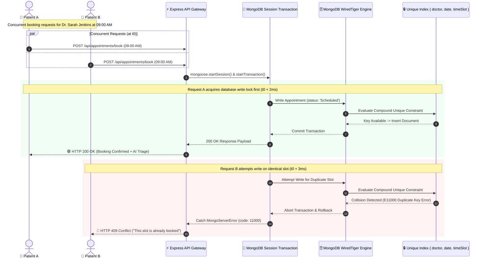

---

### ⏱️ B. Atomic 5-Minute Slot Hold Mechanism
To prevent race conditions while patients type or speak symptoms:
* When a slot is selected, `POST /api/appointments/hold` writes an initial document with `status: 'Held'` and `holdExpiresAt: Date.now() + 5 minutes`.
* A MongoDB TTL index (`{ holdExpiresAt: 1 }, { expireAfterSeconds: 0 }`) ensures background cleanup if the client disconnects.
* While held, other patients attempting to select the slot receive `409 Conflict`.
* When confirmed (`POST /api/appointments/book`), the hold transitions to `status: 'Scheduled'` and `holdExpiresAt` is removed.

---

### 🌴 C. Doctor Leave Conflict Cascading
When a doctor registers a leave day via `POST /api/doctors/leave`:
1. The leave date is recorded in `doctorProfile.leaveDays`.
2. `Appointment.find({ doctor, date, status: 'Scheduled' })` identifies all conflicting patient visits.
3. Each appointment is transitioned to `Cancelled`.
4. If Google Calendar event IDs exist, `deleteCalendarEvent` deletes the cloud event.
5. `sendDoctorLeaveCancellation` emails affected patients with the doctor's reason.

---

## 6. AI Architecture & LLM Integration

The application utilizes Google Gemini (`gemini-1.5-flash`) for structured clinical intelligence.

### A. Pre-Visit Triage Intake
```
Prompt:
Analyse these symptoms and return a JSON object with:
- urgencyLevel: exactly one of "Low", "Medium", or "High"
- chiefComplaint: a brief 1-sentence summary of the main issue
- suggestedQuestions: array of three questions for the doctor.

Return ONLY valid JSON.
Symptoms: <symptoms>
```

### B. Post-Visit Care Plan Translation
```
Prompt:
Convert these clinical notes into a JSON object with:
- patientSummary: a clear, patient-friendly explanation
- medicationSchedule: clear medication schedule
- followUpSteps: key follow-up steps

Return ONLY valid JSON.
Clinical Notes: <clinicalNotes>
```

### C. Graceful Fallback & Degradation
If `GEMINI_API_KEY` is missing or the external API experiences a network timeout, `aiService.js` catches the error and returns a structured fallback object (`isFallback: true`). The appointment booking and doctor notes submission always succeed without blocking the user.

---

## 7. Email Architecture & Failure Isolation

Emails are handled by Nodemailer in [`backend/services/emailService.js`](./backend/services/emailService.js):

* **Development/Testing:** Automatically generates an **Ethereal test inbox** if no SMTP credentials are provided, printing preview URLs to the console.
* **Production/Demo:** Configurable with Gmail or custom SMTP hosts via `.env`.
* **Standardized Status Contract:** Every email operation returns `{ status: 'EMAIL_SENT' | 'EMAIL_FAILED' | 'EMAIL_NOT_CONFIGURED', message, messageId }`.
* **Non-Blocking Isolation:** Email dispatches are wrapped in isolated `try/catch` blocks so SMTP errors never roll back successful database transactions.

---

## 8. Google Calendar OAuth 2.0 Integration

Calendar synchronization is implemented in [`backend/services/calendarService.js`](./backend/services/calendarService.js) using `googleapis`:

* **Booking:** Calls `calendar.events.insert` with start/end times and persists `googleCalendarEventId` on the Appointment document.
* **Rescheduling:** Calls `calendar.events.patch` to update the existing event without creating duplicates.
* **Cancellation:** Calls `calendar.events.delete` to remove the event from Google Calendar.
* **Status Reporting:** Returns `{ success: boolean, eventId, message }` so the UI only confirms sync when credentials are valid.

---

## 9. System Architecture

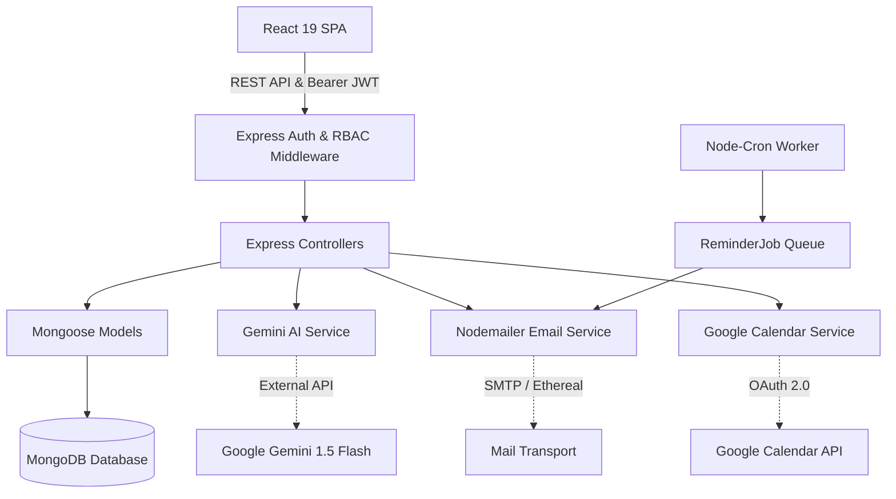

---

## 10. Database Schema

### 1. `User` Model
* `name` (String, Required)
* `email` (String, Required, Unique)
* `password` (String, Hashed with bcrypt)
* `role` (Enum: `'patient'`, `'doctor'`, `'admin'`)

### 2. `DoctorProfile` Model
* `user` (ObjectId $\rightarrow$ `User`, Required)
* `specialization` (String, e.g. `'Cardiology'`)
* `workingHours` (`{ start: "09:00", end: "17:00" }`)
* `slotDuration` (Number in minutes, default: `30`)
* `leaveDays` (`[{ date: Date, reason: String }]`)

### 3. `Appointment` Model
* `patient` (ObjectId $\rightarrow$ `User`, Required)
* `doctor` (ObjectId $\rightarrow$ `DoctorProfile`, Required)
* `date` (Date, Required)
* `timeSlot` (String, e.g. `"10:00 AM"`)
* `status` (Enum: `'Held'`, `'Scheduled'`, `'Completed'`, `'Cancelled'`)
* `holdExpiresAt` (Date, TTL index: `expireAfterSeconds: 0`)
* `symptoms` (String)
* `preVisitSummary` (`{ urgencyLevel, chiefComplaint, suggestedQuestions }`)
* `postVisitSummary` (`{ clinicalNotes, patientSummary, medicationSchedule, followUpSteps }`)
* `googleCalendarEventId` (String)
* **Compound Unique Index:** `{ doctor: 1, date: 1, timeSlot: 1 }`

### 4. `ReminderJob` Model (Persistent Retry Queue)
* `appointment` (ObjectId $\rightarrow$ `Appointment`, Unique)
* `patient` (ObjectId $\rightarrow$ `User`)
* `patientEmail` (String)
* `patientName` (String)
* `medicationSchedule` (String)
* `status` (Enum: `'PENDING'`, `'SENT'`, `'FAILED_PERMANENTLY'`)
* `attempts` (Number, default: `0`)
* `maxAttempts` (Number, default: `5`)
* `nextRunAt` (Date)
* `lastError` (String)
* **Index:** `{ status: 1, nextRunAt: 1 }`

---

## 11. API Endpoints

| Method | Endpoint | Auth | Role | Purpose |
| :--- | :--- | :---: | :---: | :--- |
| `POST` | `/api/auth/register` | None | Public | Register new patient, doctor, or admin |
| `POST` | `/api/auth/login` | None | Public | Authenticate user & receive JWT |
| `GET` | `/api/auth/me` | JWT | Any | Retrieve logged-in user profile |
| `GET` | `/api/doctors` | None | Public | List doctors (filter by `?specialization=`) |
| `GET` | `/api/doctors/:id/available-slots` | None | Public | Dynamic slots for doctor on `?date=YYYY-MM-DD` |
| `POST` | `/api/doctors` | JWT | Admin | Create new doctor profile |
| `PUT` | `/api/doctors/:id` | JWT | Admin | Update doctor working hours/duration |
| `DELETE` | `/api/doctors/:id` | JWT | Admin | Delete doctor profile |
| `POST` | `/api/doctors/leave` | JWT | Doctor | Register leave day & cancel conflicting visits |
| `POST` | `/api/appointments/hold` | JWT | Patient | Atomically hold slot for 5 minutes |
| `POST` | `/api/appointments/book` | JWT | Patient | Finalize booking + AI triage + email + calendar |
| `PUT` | `/api/appointments/:id/cancel` | JWT | Patient/Doc | Cancel appointment + trigger refund email |
| `PUT` | `/api/appointments/:id/reschedule` | JWT | Patient | Reschedule to new date/time slot |
| `POST` | `/api/appointments/:id/post-visit` | JWT | Doctor | Submit clinical notes + generate AI care plan |
| `GET` | `/api/appointments/my` | JWT | Any | Get current user's appointment records |

---

## 12. Failure Handling Matrix

| Component | Failure Mode | System Behavior |
| :--- | :--- | :--- |
| **Gemini LLM** | Network timeout / Missing API key | Returns structured fallback triage/summary; appointment booking succeeds. |
| **Nodemailer** | SMTP connection drop / Invalid auth | Logs error, returns `EMAIL_FAILED`, persists core booking in MongoDB. |
| **Google Calendar** | Missing refresh token / OAuth expiry | Logs warning, returns `{ success: false }`, avoids crashing booking. |
| **Concurrent Booking** | Two patients confirm same slot simultaneously | Second request hits MongoDB unique constraint and receives HTTP `409 Conflict`. |
| **Expired Slot Hold** | 5-minute timer elapses before confirmation | MongoDB TTL index purges hold; slot is returned to available pool. |
| **Server Restart** | Node process crashes during reminder retries | All retry counters & `nextRunAt` timestamps persist in MongoDB `ReminderJob` collection. |

---

## 13. Local Installation & Setup

### Prerequisites
* **Node.js**: v18+ installed
* **MongoDB**: Local MongoDB instance (`mongodb://localhost:27017`) or MongoDB Atlas URI

### 1. Clone & Setup Backend
```bash
cd backend
npm install
cp .env.example .env
```

Edit `backend/.env` with your preferred configuration:
```env
PORT=5000
MONGO_URI=mongodb://localhost:27017/healthcare_manager
JWT_SECRET=super_secret_jwt_key_12345
GEMINI_API_KEY=your_gemini_api_key_optional
```

### 2. Seed Initial Clinic Data
```bash
npm run seed
```
*Creates initial demo users: Patient (`alex.rivera@example.com`), Doctor (`sarah.jenkins@clinic.com`), and Admin (`admin@clinic.com`) with password `password123`.*

### 3. Start Backend Server
```bash
npm run dev
# Server running on port 5000
```

### 4. Setup & Start Frontend
```bash
cd ../frontend
npm install
npm run dev
# Vite dev server running at http://localhost:5173/
```

---

## 14. Automated Unit Testing

HealthPulse AI includes 26 unit tests covering concurrency, AI fallback, calendar persistence, reminder queues, and email flows:

```bash
cd backend
npm test
```

### Test Suite Summary:
```
PASS tests/reminder.test.js    (Bounded backoff, retry limits, deduplication)
PASS tests/booking.test.js     (Double-booking prevention, concurrency locks, leave conflicts)
PASS tests/ai.test.js          (Pre/Post-visit LLM generation & fallback behavior)
PASS tests/calendar.test.js    (OAuth lifecycle, event persistence, patch/delete)
PASS tests/email.test.js       (Nodemailer delivery status contracts & 5 notification flows)

Test Suites: 5 passed, 5 total
Tests:       26 passed, 26 total
```

---

## 15. Recommended Evaluator Demonstration Flow

To verify the complete clinical loop in under 5 minutes:

1. **Sign in as Admin** (`admin@clinic.com` / `password123`):
   * View the **Operations KPI Dashboard**.
   * Edit Dr. Sarah Jenkins' working hours or slot duration (e.g. `30` mins).
2. **Sign in as Patient** (`alex.rivera@example.com` / `password123`):
   * Select **Cardiology** $\rightarrow$ **Dr. Sarah Jenkins**.
   * Click an available time slot $\rightarrow$ **Observe the 5-minute atomic reservation countdown card**.
   * Type or use **🎙️ Voice Input** to describe symptoms: *"Severe migraine with sensitivity to light for 3 days."*
   * Click **Confirm Booking** $\rightarrow$ Observe AI urgency score and suggested clinical questions.
3. **Sign in as Doctor** (`sarah.jenkins@clinic.com` / `password123`):
   * In the **Doctor Workspace Queue**, locate the scheduled patient.
   * Click **Start Consultation** $\rightarrow$ Review the AI pre-visit intake card.
   * Enter clinical notes: *"Diagnosed migraine with aura. Prescribed Sumatriptan 50mg PRN. Rest in dark room."*
   * Click **Save Notes & Generate Care Plan** $\rightarrow$ Observe real-time Gemini LLM translation.
4. **Sign back in as Patient** (`alex.rivera@example.com` / `password123`):
   * Go to **My Appointments** $\rightarrow$ Click **📋 View Care Plan**.
   * Verify all 5 structured medical components: Visit summary, medication schedule, follow-up instructions, appointment date, and attending doctor details.

---

## 16. Google Calendar & Email Configuration (Optional)

### Google Calendar OAuth 2.0 Setup
1. Create a project in [Google Cloud Console](https://console.cloud.google.com/).
2. Enable the **Google Calendar API**.
3. Create OAuth 2.0 Client Credentials (Web Application) with redirect URI: `https://developers.google.com/oauthplayground`.
4. In OAuth 2.0 Playground, authorize the scope `https://www.googleapis.com/auth/calendar` and exchange for a Refresh Token.
5. Set `GOOGLE_CLIENT_ID`, `GOOGLE_CLIENT_SECRET`, and `GOOGLE_REFRESH_TOKEN` in `backend/.env`.

### Email (SMTP) Setup
* **Development:** Defaults to automatic **Ethereal Email** test accounts (no setup required).
* **Production/Gmail:** Set `EMAIL_SERVICE=gmail`, `EMAIL_USER=your_email@gmail.com`, and `EMAIL_PASS=your_gmail_app_password` in `backend/.env`.

---

## 17. Technical Trade-Offs & Honest Limitations

* **OAuth Token Scope:** Google Calendar requires user-delegated OAuth 2.0 refresh tokens. If credentials are not supplied, the application gracefully skips calendar synchronization without interrupting booking.
* **Background Worker Architecture:** To avoid requiring Redis/BullMQ infrastructure for evaluation, the background reminder queue is implemented as a MongoDB-backed persistent job queue driven by `node-cron`.
* **Speech Recognition:** Voice input uses standard browser Web Speech APIs (`window.webkitSpeechRecognition`), supported natively in Google Chrome and Microsoft Edge.

---

## 18. Project Structure

```
unthinkable/
├── backend/
│   ├── config/
│   │   └── db.js                 # MongoDB connection handler
│   ├── controllers/
│   │   ├── appointmentController.js # Booking, hold, reschedule, post-visit
│   │   ├── authController.js        # Register, login, getMe
│   │   └── doctorController.js      # Availability, slots, leave, CRUD
│   ├── middleware/
│   │   └── authMiddleware.js        # JWT verification & RBAC guard
│   ├── models/
│   │   ├── Appointment.js           # Unique index, TTL index, schemas
│   │   ├── DoctorProfile.js         # Working hours, slot duration, leave
│   │   ├── ReminderJob.js           # Persistent retry queue data model
│   │   └── User.js                  # User credentials & roles
│   ├── routes/
│   │   ├── appointmentRoutes.js     # /api/appointments/*
│   │   ├── authRoutes.js            # /api/auth/*
│   │   └── doctorRoutes.js          # /api/doctors/*
│   ├── services/
│   │   ├── aiService.js             # Gemini 1.5 Flash triage & post-visit
│   │   ├── calendarService.js       # Google Calendar OAuth API
│   │   ├── cronService.js           # Persistent reminder queue worker
│   │   └── emailService.js          # Nodemailer notification flows
│   ├── tests/
│   │   ├── ai.test.js               # AI fallback unit tests
│   │   ├── booking.test.js          # Concurrency & double-booking tests
│   │   ├── calendar.test.js         # Calendar event lifecycle tests
│   │   ├── email.test.js            # Notification status contract tests
│   │   └── reminder.test.js         # Exponential backoff & retry tests
│   ├── package.json
│   ├── seed.js                      # Initial clinic database seeder
│   └── server.js                    # Express app entrypoint
├── docs/
│   └── screenshots/                 # Application visual walkthrough assets
├── frontend/
│   ├── src/
│   │   ├── api.js                   # Axios/Fetch API client wrapper
│   │   ├── App.jsx                  # Clinical SaaS portals (Patient/Doctor/Admin)
│   │   ├── index.css                # Professional healthcare design system
│   │   └── main.jsx
│   └── package.json
├── SYSTEM_DESIGN.md                 # In-depth system design & concurrency write-up
└── README.md
```
